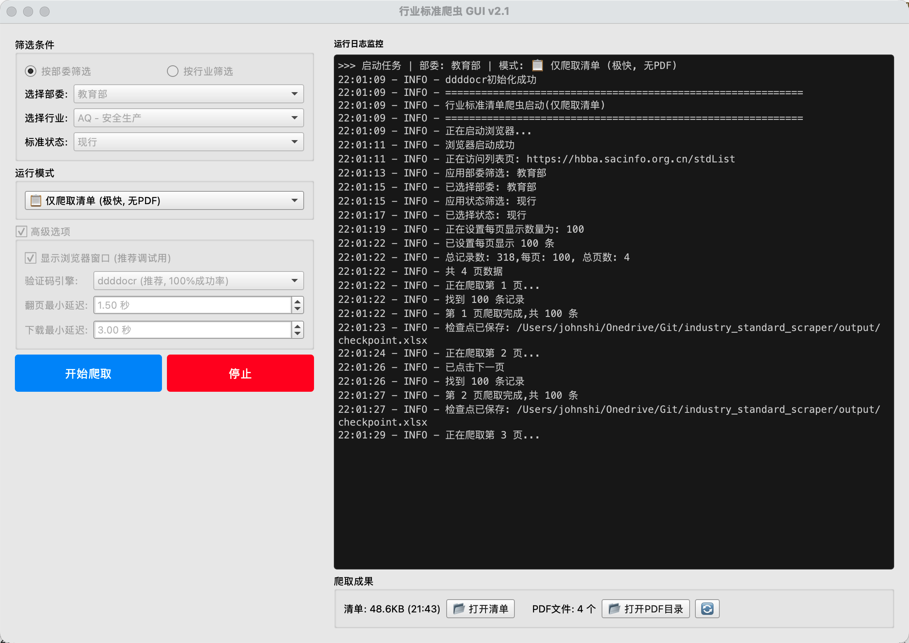

# 行业标准信息爬虫 (Industry Standard Scraper) v2.1



## 📌 项目简介

这是一个功能强大的行业标准信息爬取工具，支持从[行业标准信息服务平台](https://hbba.sacinfo.org.cn/)抓取最新的标准列表、详情以及**自动下载 PDF 全文**。

项目最新集成了 **PySide6 可视化界面** 和 **ddddocr 验证码自动识别**，实现了全自动化的一键爬取。

## ✨ 核心功能

*   **GUI 可视化操作**：提供现代化的 Qt 界面，支持实时日志监控和进度显示。
*   **全自动验证码识别**：内置深度学习 OCR 模型 (`ddddocr`)，识别成功率接近 100%。
*   **智能筛选**：支持按部委、行业代码、标准状态（现行/废止）进行精确筛选。
*   **PDF 自动下载**：自动处理验证码，下载标准全文 PDF，并规范命名。
*   **断点续传**：意外中断后，支持从检查点恢复，不丢失已爬取数据。
*   **反爬策略**：内置随机延迟、User-Agent 轮询和行为模拟。

## 🛠️ 环境要求

*   macOS (推荐) / Windows / Linux
*   Python 3.10+ (推荐使用 Python 3.13 以获得最佳 ddddocr 兼容性)
*   Chromium 内核浏览器 (由 Playwright 自动安装)

## 🚀 快速开始

### 1. 克隆项目
```bash
git clone https://github.com/cikorsky/industry_standard_scraper.git
cd industry_standard_scraper
```

### 2. 创建并激活虚拟环境 (强烈推荐)
由于 `ddddocr` 等库对环境有特定要求，建议使用独立的虚拟环境。

```bash
# 创建 Python 3.13 环境 (如果已安装)
python3.13 -m venv venv_py313

# 激活环境
source venv_py313/bin/activate
```

### 3. 安装依赖
```bash
pip install -r requirements.txt
playwright install chromium
```

### 4. 运行程序

**方式一：可视化界面 (推荐)**
```bash
./run_gui.sh
# 或者
python gui_app.py
```

**方式二：命令行模式**
```bash
./demo.sh
```

## ⚙️ 高级配置

在 GUI 的"高级选项"中，或直接修改 `config.py` 文件：
- **Headless Mode**: 是否显示浏览器窗口。
- **OCR Engine**: 切换 OCR 引擎 (ddddocr/EasyOCR)。
- **Delay**: 调整翻页和下载的间隔时间。

## 📂 输出结果

所有爬取结果将保存在 `output/` 目录下：
- **Excel 清单**: `output/standards.xlsx`
- **PDF 文件**: `output/pdfs/`

## ❤️ 致谢 (Credits)

本项目引用了以下优秀的开源库，特此感谢：

*   **[ddddocr](https://github.com/sml2h3/ddddocr)**: 强大的通用验证码识别库 (带带弟弟OCR)，实现了本项目的零人工干预自动化。
*   **[Playwright for Python](https://github.com/microsoft/playwright-python)**: 微软开源的新一代浏览器自动化测试框架，提供了稳定高效的网页交互能力。
*   **[PySide6 (Qt for Python)](https://doc.qt.io/qtforpython/)**: Qt 官方的 Python 绑定，赋予了本项目现代化的图形操作界面。
*   **[Pandas](https://pandas.pydata.org/)**: 强大的数据分析和处理库，用于生成结构化的 Excel/CSV 报表。

## ⚠️ 免责声明

本工具仅供技术学习和科研使用，请勿用于非法用途。请遵守目标网站的 `robots.txt` 协议，合理控制爬取频率，避免对服务器造成压力。

## 📄 许可证

[MIT License](LICENSE)
